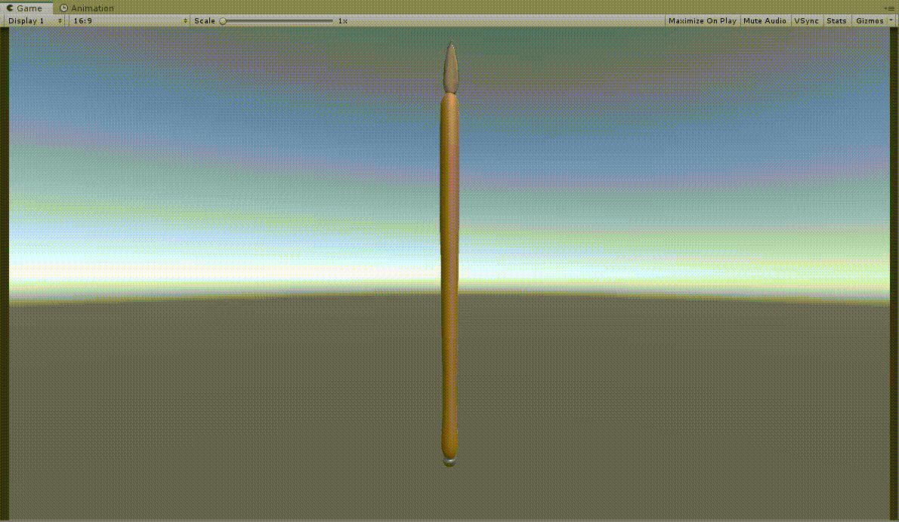

# ModularItems
This tool can be used to generate procedural items, focusing mostly on weapons.

# Usage

Apply the `WeaponFactory` to a GameObject, assign the values it needs, go into play mode and press the 'Generate' button.

You should see something like this;

